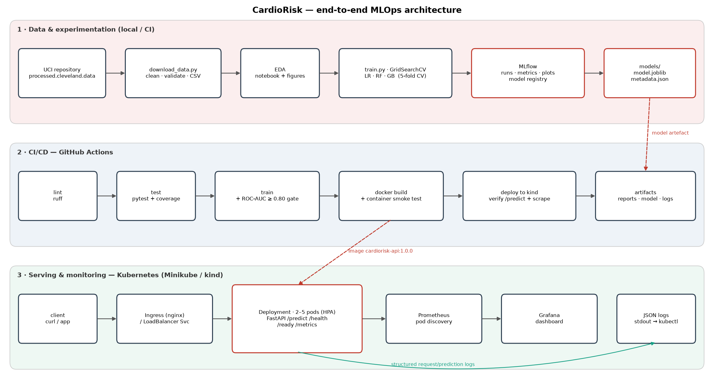

# CardioRisk — Heart-Disease Risk Prediction with an End-to-End MLOps Pipeline

**Course:** Machine Learning Operations (AIMLCZG523) — Assignment 1 · **Student:** Gaurisha Mathur (2025ae05642)
**Repository:** https://github.com/flow-shiftt/heart-disease-mlops
**Report:** [`docs/MLOps_Assignment1_Report.docx`](docs/MLOps_Assignment1_Report.docx) (PDF copy alongside) · **Evidence:** [`screenshots/`](screenshots), [`docs/logs/`](docs/logs)

CardioRisk predicts the presence of heart disease from 13 clinical measurements (UCI Heart Disease,
Cleveland subset) and serves the model as a monitored, containerised REST API on Kubernetes.



| Stage | What is implemented | Where |
|---|---|---|
| Data | Download script with fallback mirror, SHA-256 fingerprint, range/category validation, `?` → NaN | `scripts/download_data.py`, `src/cardiorisk/data.py` |
| EDA | 6 figures: class balance, histograms, Spearman heat-map, per-category disease rates, missingness, box-plots | `notebooks/01_eda.ipynb`, `reports/figures/` |
| Features | `ClinicalFeatureBuilder` (heart-rate reserve %, BP×cholesterol load) → impute → scale / one-hot, all inside one sklearn `Pipeline` | `src/cardiorisk/features.py` |
| Models | Logistic Regression, Random Forest, Gradient Boosting; `GridSearchCV`, stratified 5-fold CV, 5 metrics | `src/cardiorisk/train.py` |
| Tracking | MLflow: parent run → per-family run → one nested run per grid candidate (56 runs per training: 1 parent + 3 family + 52 grid candidates); params, metrics, plots, CSVs, models, registry | `mlflow.db` (local), CI artifact |
| Packaging | `model.joblib` + MLflow model (skops, explicit trusted types) + `metadata.json`; pinned `requirements*.txt` | `models/` |
| Tests | 26 pytest tests: data cleaning, features, models, API contract, metrics, logging | `tests/` |
| CI/CD | GitHub Actions: lint → test → train (+quality gate) → Docker build + smoke test → deploy to kind + verify | `.github/workflows/ci.yml` |
| Serving | FastAPI `/predict`, `/predict/batch`, `/health`, `/ready`, `/model-info`, `/metrics` | `src/cardiorisk/api/` |
| Container | `python:3.12-slim`, runtime-only deps, non-root, healthcheck | `Dockerfile` |
| Deployment | Namespace, Deployment (2 replicas, probes, limits, hardened securityContext), LoadBalancer Service, Ingress, HPA | `deploy/k8s/` |
| Monitoring | JSON request logs, Prometheus metrics (latency, status, predictions, probability histogram, validation errors), Prometheus pod discovery, provisioned Grafana dashboard | `src/cardiorisk/api/monitoring.py`, `deploy/monitoring/` |

---

## 1. Setup

Requires Python 3.11+ (3.12 used in CI and Docker), Docker, and for deployment `kubectl` + Minikube
(or Docker Desktop Kubernetes).

```bash
git clone https://github.com/flow-shiftt/heart-disease-mlops.git
cd heart-disease-mlops
python -m venv .venv && source .venv/bin/activate
pip install -r requirements-dev.txt && pip install -e . --no-deps
```

## 2. Run the pipeline

```bash
python scripts/download_data.py      # data/raw + data/processed/heart_clean.csv
python scripts/run_eda.py            # reports/figures/*.png
python -m cardiorisk.train           # tune 3 model families, log to MLflow, package best model
pytest -v                            # 26 unit tests
ruff check .                         # lint
mlflow ui --backend-store-uri sqlite:///mlflow.db --port 5000   # browse experiments
```

Notebooks (`notebooks/01_eda.ipynb`, `02_training.ipynb`, `03_inference.ipynb`) are generated by
`scripts/build_notebooks.py` and committed with outputs.

### Data acquisition (manual alternative)
Download `processed.cleveland.data` from the UCI repository
(https://archive.ics.uci.edu/dataset/45/heart+disease → *heart+disease.zip*) into `data/raw/`, then run
`python scripts/download_data.py` to produce the cleaned CSV.

## 3. Serve the model

```bash
# local
PYTHONPATH=src uvicorn cardiorisk.api.app:app --port 8000
# docker
docker build -t cardiorisk-api:1.0.0 .
docker run --rm -p 8000:8000 cardiorisk-api:1.0.0
# test
curl -X POST localhost:8000/predict -H 'content-type: application/json' -d @sample_request.json
bash scripts/smoke_test.sh http://localhost:8000
```

Example response:

```json
{"prediction": 1, "label": "disease", "confidence": 0.9969, "probability_disease": 0.9969,
 "risk_band": "high", "model_name": "logistic_regression", "model_version": "1.0.0+…", "request_id": "aac248f29a65"}
```

Interactive API docs: `http://localhost:8000/docs`.

## 4. Deploy to Kubernetes (Minikube)

```bash
minikube start --driver=docker
minikube addons enable ingress
minikube image load cardiorisk-api:1.0.0
kubectl apply -k deploy/k8s              # namespace, deployment, LB service, ingress, HPA
kubectl apply -k deploy/monitoring       # Prometheus (pod discovery) + Grafana
kubectl -n cardiorisk rollout status deploy/cardiorisk-api

# access via LoadBalancer
minikube tunnel                          # separate terminal
kubectl -n cardiorisk get svc cardiorisk-api   # EXTERNAL-IP
# or via Ingress
curl -H 'Host: cardiorisk.local' http://$(minikube ip)/health
# dashboards
kubectl -n cardiorisk port-forward svc/grafana 3000:3000
```

Local monitoring without Kubernetes: `docker compose up --build` → API :8000, Prometheus :9090, Grafana :3000.

## 5. CI/CD

`.github/workflows/ci.yml` runs on every push and PR:

1. **lint** — `ruff check`
2. **test** — pytest with coverage, JUnit XML and `pip freeze` uploaded
3. **train** — download data, EDA, full training, **quality gate: hold-out ROC-AUC ≥ 0.80**, model/MLflow/figures uploaded, metrics in job summary
4. **docker** — build image, run container, smoke test (`/health`, `/predict`, 422 on bad input, `/metrics`), container logs uploaded
5. **deploy** — ephemeral **kind** cluster, apply manifests, rollout, smoke test through the Service, assert Prometheus sees ≥ 2 healthy replicas, cluster state uploaded

`bash -euo pipefail` on every step plus `needs:` chaining means any failure stops the pipeline with a clear log.

## 6. Results (hold-out = 20 % stratified, never used for selection)

| Model | CV ROC-AUC (mean ± std) | CV accuracy | Test ROC-AUC | Test accuracy | Test recall |
|---|---|---|---|---|---|
| **Logistic Regression** (selected) | **0.907 ± 0.015** | 0.831 | 0.958 | 0.869 | 0.929 |
| Random Forest | 0.896 ± 0.025 | 0.814 | 0.954 | 0.885 | 0.929 |
| Gradient Boosting | 0.881 ± 0.021 | 0.818 | 0.957 | 0.902 | 0.929 |

## Repository layout

```
├── src/cardiorisk/        package: config, data, features, train, evaluate, eda, predict, api/
├── scripts/               download_data, run_eda, build_notebooks, draw_architecture, smoke_test.sh
├── notebooks/             01_eda, 02_training, 03_inference (executed)
├── tests/                 pytest suite
├── data/raw, data/processed
├── models/                model.joblib, metadata.json, mlflow_model/
├── reports/figures/       EDA + model comparison figures
├── deploy/k8s/            Kubernetes manifests (kustomize)
├── deploy/monitoring/     Prometheus + Grafana (compose and k8s)
├── screenshots/           evidence for the report
├── docs/                  report, architecture diagram, logs
├── Dockerfile, docker-compose.yml, Makefile
└── requirements.txt, requirements-dev.txt, requirements-serve.txt
```
